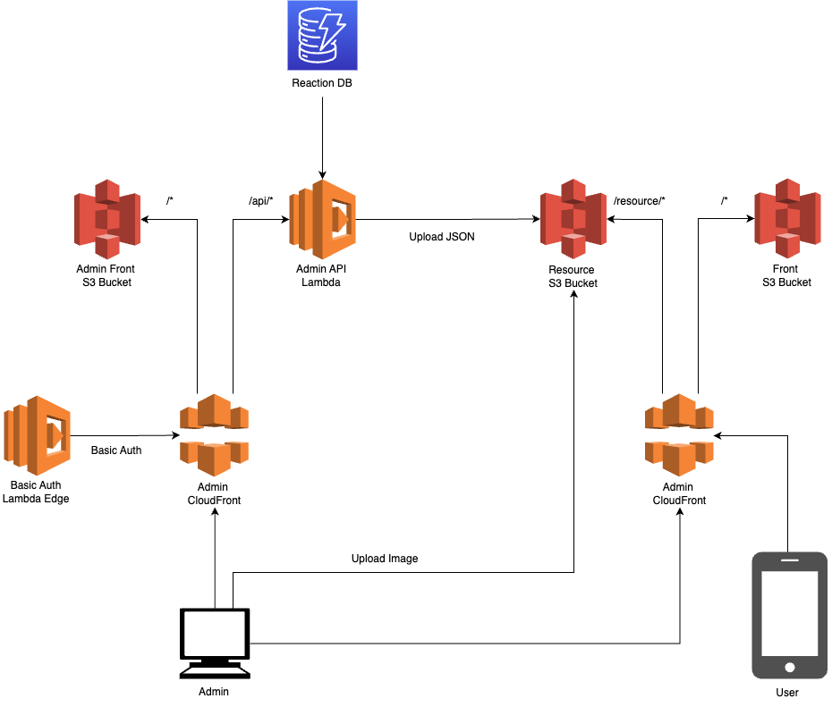

# アーキテクチャ

## システム構成図



## コンポーネント

### 管理画面 (admin/)

- **技術**: Next.js 15, React 19, TypeScript 5
- **ホスティング**: S3 + CloudFront
- **用途**: 反応データの登録・編集・削除

### API (application/)

- **技術**: Go 1.22+, Echo v4, AWS SDK v2
- **ホスティング**: AWS Lambda
- **用途**: 反応データのCRUD操作、画像アップロードURL生成

### データベース

- **技術**: Amazon DynamoDB
- **用途**: 反応データの永続化

### ストレージ

- **技術**: Amazon S3
- **用途**: 画像ファイルの保存

### CDN

- **技術**: Amazon CloudFront
- **用途**: 静的ファイル・画像の配信

## リソース構成

S3のリソースバケット構成：

```
resource/
├── image/
│   ├── original/
│   │   └── {UUID}.png
│   └── resized/
│       └── {UUID}.png
├── reaction/
│   ├── list.json
│   └── {ID}/
│       └── reaction.json
└── question/
    └── list.json
```

### 学習問題のデータフロー

学習問題は管理画面から登録・編集し、「データ更新」で S3 にエクスポートします。

- **DynamoDB `questions` テーブル**: マスターデータ（id, order, problemImageNames, solutionImageNames, references）
- **S3 `resource/question/list.json`**: アプリ配信用 JSON（order 順でソート済み、画像URLに変換済み）
- **S3 `resource/image/{UUID}.png`**: 問題・解答の画像ファイル（反応機構と共有）

## 編集用ファイル

アーキテクチャ図の編集用drawioファイルは [こちら](images/architecture.drawio) からダウンロードできます。
